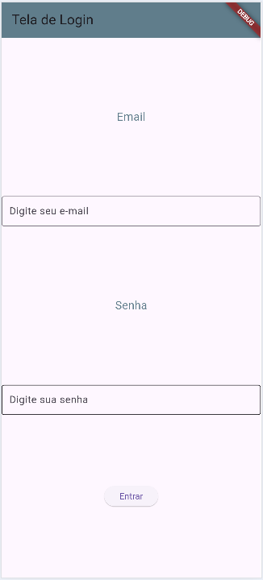
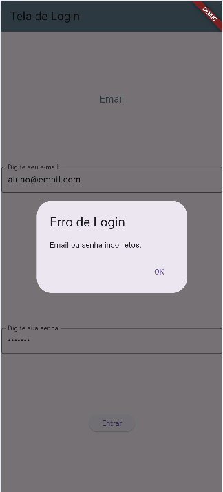
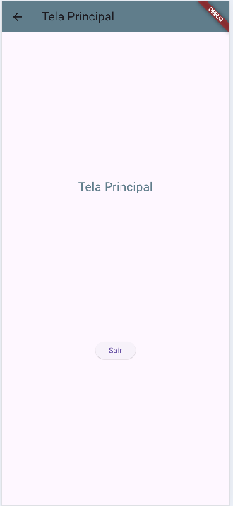

# AppLogin
Aplicativo simples de login com dados estáticos.
```
email: aluno@email.com
senha: senha123
```
||||
|-|-|-|
|Tela Login|Senha errada|Tela Home|

## Tecnologias
- Flutter
- Dart
- Android Studio
- VsCode

## Como testar
- 1 Clonar o repositório
- 2 Abrir com Android Studio ou VsCode
- 3 Em um terminal, executar o comando:
```bash
flutter pub get
```
- 4 Executar o aplicativo em um emulador ou dispositivo físico ou em um navegador:
```bash
flutter run
```
